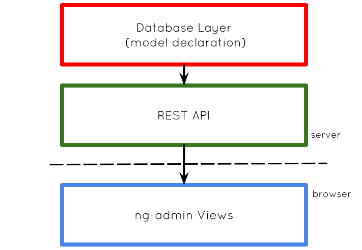

Design
------

**aiohttp_admin** using following design philosophy:

- backend and frontend of admin views are decoupled by REST API as
  result it is possible to change admin views without changing any **python**
  code. On browser side user interacts with single page application (ng-admin).

- admin views are database agnostic, if it is possible to implement REST API
  it should be strait forward to add admin views. Some filtering features may
  be disabled if database do not support some kind of filtering.

